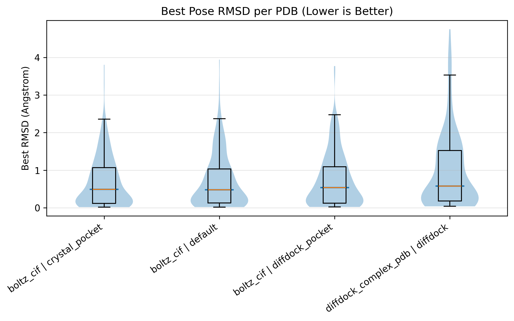
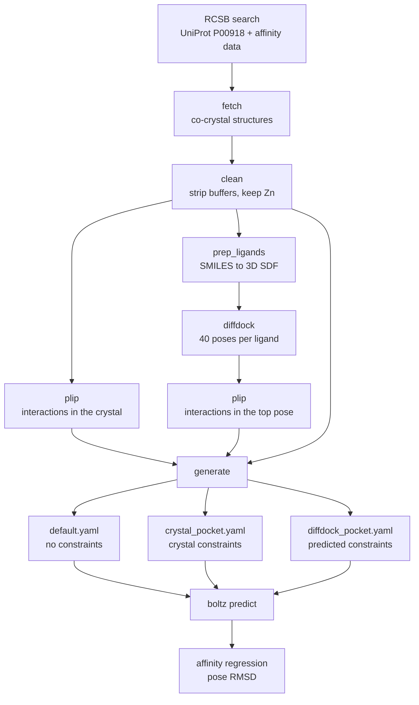

# PLIP Constraints Pipeline

Do structural priors help a co-folding model? This pipeline builds Boltz-2
inputs with interaction constraints derived from experimental co-crystal
structures or from DiffDock poses, against an unconstrained baseline from the
same run, and measures the difference in affinity accuracy and pose quality.

Benchmark target: human carbonic anhydrase II (UniProt **P00918**), 200
co-crystal structures from the PDB.



## Key results

Constraints did **not** improve predictions on this benchmark. Both the
affinity correlation and the pose accuracy are best without them.

| Scenario | Affinity R² (n=200) | Median pose RMSD (n=193) |
|---|---|---|
| **Default, no constraints** | **0.586** | **0.477 Å** |
| DiffDock constraints | 0.563 | 0.538 Å |
| Co-crystal constraints | 0.531 | 0.491 Å |

That experimentally derived constraints score *worst* inverts the naive
expectation, and the likely reason is the benchmark itself: these are
PDB-deposited structures, well covered by the model's training data. The
unconstrained model can lean on memorised binding patterns, and a constraint
that restricts the pocket conflicts with them. Boltz-2 already places the
ligand at a median 0.48 Å, so there is little room left to improve.

**Where the method does become interesting** is the opposite case — compounds
the model has never seen. In prospective screening of a natural-product library
([`boltz2-molport-screening`](https://github.com/NikMibu/boltz2-molport-screening)),
the same constraints reorder the top 100 substantially (r = 0.53 between
constrained and default ranking, individual shifts up to ±70 positions). That
is not refinement, it is different information. Constraints look most useful
exactly where training-data priors are least reliable.

Practical reading: use unconstrained Boltz-2 as the primary ranker, treat
constrained output as a complementary structural hypothesis for novel
chemotypes.

## Pipeline

Two workflows produce constraints from different sources, so the comparison
runs against one shared baseline.



Metal coordination is excluded from the constraints on purpose: for carbonic
anhydrase almost every inhibitor binds the catalytic zinc through the same
histidine triad, so those contacts carry no ligand-specific information.

## Constraint types

Both are emitted with `force: false`, i.e. the model is conditioned on them
rather than steered by a potential.

**Pocket** — the ligand must come within `max_distance` of *at least one* of
the listed residues.

```yaml
constraints:
  - pocket:
      binder: "AZM"
      contacts: [["A", 199], ["A", 200], ["A", 131]]
      max_distance: 6.0
      force: false
```

**Contact** — pairwise, the ligand must come within `max_distance` of *every*
listed residue. Stricter.

## Installation

Python 3.10, PLIP and DiffDock in separate micromamba environments.
Full instructions in [SETUP.md](SETUP.md).

```bash
git clone https://github.com/NikMibu/plip_constraints_pipeline.git
cd plip_constraints_pipeline
pip install -r requirements.txt

micromamba create -n plip -c conda-forge python=3.9 openbabel=3.1.1
micromamba run -n plip pip install plip==2.3.1

python validate_setup.py
```

`validate_setup.py` checks what the pipeline actually calls — the micromamba
environments, PLIP, Boltz-2, DiffDock, and the RCSB and UniProt endpoints — and
separates required from optional, so a missing DiffDock does not block the
crystal workflow.

## Quickstart

The crystal workflow needs no GPU and no DiffDock. Set `fetch.limit` in
`config.yaml` to a small number first.

```bash
python3 pipeline.py --steps crystal      # fetch, clean, PLIP, YAMLs
python3 pipeline.py --stats
```

Roughly 10 minutes for 20 structures, mostly RCSB downloads. Output:
`output/boltz_inputs/` with two or three YAMLs per structure. Structures whose
ligand only coordinates the zinc yield a baseline YAML and no constraint YAML —
that is expected, not a failure.

## Full run

```bash
export DIFFDOCK_HOME=/path/to/DiffDock
python3 pipeline.py --steps all
micromamba run -n boltz boltz predict output/boltz_inputs --out_dir output/boltz_results

python3 analysis/parse_boltz_predictions.py  --results-dir output/boltz_results
python3 analysis/analyze_affinity_predictions.py
python3 analysis/compute_pose_rmsd.py --boltz-dir output/boltz_results
python3 analysis/analyze_pose_rmsd.py
```

Boltz-2 runs at its default parameters (3 recycling / 200 sampling /
5 affinity recycling / 200 affinity sampling), roughly 5–10 minutes per complex
per scenario. DiffDock generates 40 poses per ligand.

## Repository layout

```
pipeline.py              CLI: --steps fetch,clean,plip,generate,prep_ligands,diffdock,...
validate_setup.py        pre-flight checks
config.yaml              target, cutoffs, environment names
plip_pipeline/           fetcher, cleaner, ligand_prep, plip, diffdock, generator
analysis/                affinity regression, pose RMSD
data/pdb_ids.txt         the 200 benchmark structures
results/example/         outputs of the run behind the numbers above
```

## Data

Structures from [RCSB PDB](https://www.rcsb.org/), selected by UniProt
accession with a reported binding affinity; the resulting list is checked in as
`data/pdb_ids.txt`. Target sequence from UniProt, MSA in `data/msa/`. No
licence restrictions — everything is public.

## Limitations

**OpenBabel decides the constraints.** PLIP does not place hydrogens, OpenBabel
does, and PLIP derives hydrogen bonds from them. Re-running with a different
OpenBabel changes individual constraints: for 3KWA, residue His94 is contacted
under OpenBabel 3.1.1 and not under 3.2.1, with the PLIP version making no
difference. Pin `openbabel==3.1.1` for reproduction; see the note in
[`requirements.txt`](requirements.txt).

**One target.** All conclusions are for carbonic anhydrase II, a small,
rigid, extremely well-characterised active site. The training-data-overlap
argument above is an interpretation, not a controlled result — testing it needs
a benchmark of compounds outside the model's training distribution.

**Benchmark composition.** About 7 % of the co-crystal structures are
active-site mutants, mostly His64Ala, which adds noise to the affinity
regression.

**Superseded analysis outputs.** `results_RMSD/analysis/` contains three
generations of the RMSD computation. Only `rmsd_correct_map/` and the
`common_subsets/` derived from it use the corrected atom mapping and back the
numbers above; the files at the top level of that directory are an earlier
mapping and report a median around 4 Å. `results/example/` contains only the
current ones.

## Related repositories

| | |
|---|---|
| [`boltz2-dude-benchmark`](https://github.com/NikMibu/boltz2-dude-benchmark) | Retrospective validation of Boltz-2 affinity prediction on DUD-E |
| [`boltz2-molport-screening`](https://github.com/NikMibu/boltz2-molport-screening) | Prospective natural-product screening and constraint re-ranking |

## Citation

Interaction profiling with [PLIP](https://plip-tool.biotec.tu-dresden.de/),
co-folding and affinity prediction with
[Boltz-2](https://github.com/jwohlwend/boltz), docking with
[DiffDock](https://github.com/gcorso/DiffDock). See [CITATION.cff](CITATION.cff).

## Licence

MIT, see [LICENSE](LICENSE).
